# nn_precipitation_forecast

基于神经网络进行1-60天逐日降水预测研究，Precipitation Forecast Based on Neural Network

## 简介

预测未来10-30天以上的降水任务在气象上称为延伸期降水预报，目前的延伸期预报原理主要基于数值预报和集合预报，其主要通过建立流体力学和热力学方程组进行求解来预测未来一段时间的大气运动和天气现象。而基于深度学习进行延伸期降水预报的研究则少之又少，这里尝试使用LSTM和图卷积神经网络来进行未来1-60天的逐日降水预测。

## 问题分解

当试图预测未来的气象变化时，需要对直到现在的一个气象状态有一定的了解。简单地说，需要通过过去连续时间内的气象状态的变化，来预估未来的气象状态的变化，这里的气象状态可以简单的理解为一天中降水量在空间中的分布特征。

于是问题可以分解为两部分：

1. 降水空间特征的提取
2. 时间序列的预测

## 降水空间特征提取

首先观测降水量在空间中的分布，下面是一天中全国2000多个国家站监测到的降水量：

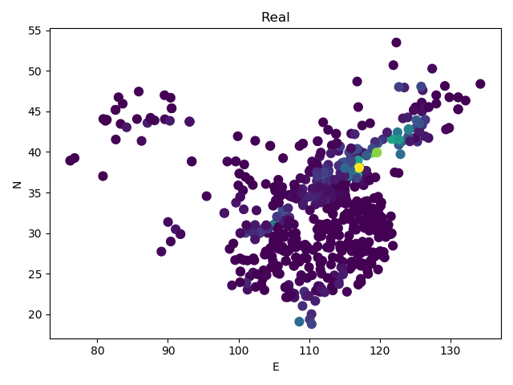

从图像中可以知道：

1. 一天中存在记录的点的数量是不固定的，可以是2000，也可以是2001
2. 点的位置分布不均匀，即各个点之间的距离都不相同

从上面两点来看，似乎无法应用卷积神经网络来提取空间特征，毕竟卷积神经网络只能处理像素点这类等间距的点。当然，可以先用克里金等插值方法对降水量进行插值，仍然可以得到图像这样的数据，不过这间接引入了误差。

为了规避误差的引入，考虑一种直接针对非欧几里得点的卷积方法，即**图卷积神经网络**，这里采用的是空域卷积。

### 图卷积神经网络的使用思路

首先需要明确的一点是通过图卷积神经网络提取到的空间特征，应该亦能还原为实际点上的值。

因此，整个架构类似自动编码器，作为编码器的图神经网络负责提取空间特征，而作为解码器的图神经网络负责解码空间特征，将其还原为具体的2000多个点上的值。并通过计算还原值与真实值之间的误差进行训练。

训练完成后，作为编码器的图神经网络即可作为空间特征提取器。

### 图卷积神经网络的效果

为了验证提取到的空间特征的效果，下面是原始输入与解码器输出的对比图，可以看到效果还是很不错的，基本可以正确还原：

  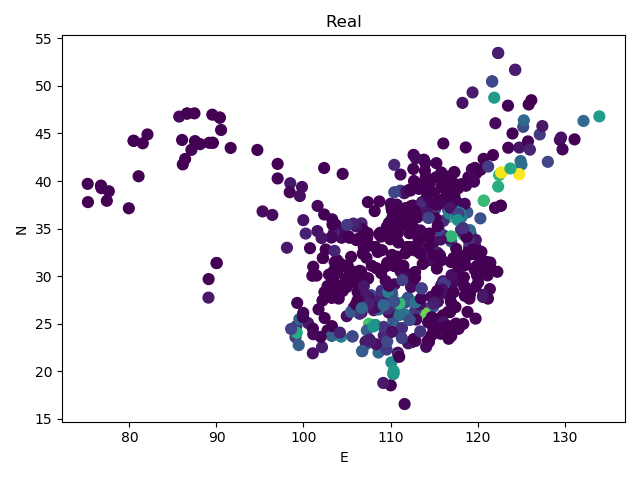
  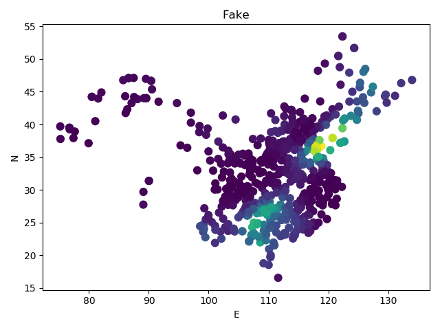

## 时间序列预测

降水空间特征提取完成之后，就可以进行时间序列的预测了，这里直接采用LSTM来进行预测，训练过程不做多余说明。

预测时通过输入连续90天的空间特征序列，输出未来60天的空间特征序列，并使用作为解码器的图神经网络来还原到具体某个点上的值。

以下是随机选取的几个月某点的未来1-60天的降水预测效果：

### 降水预测效果

    

    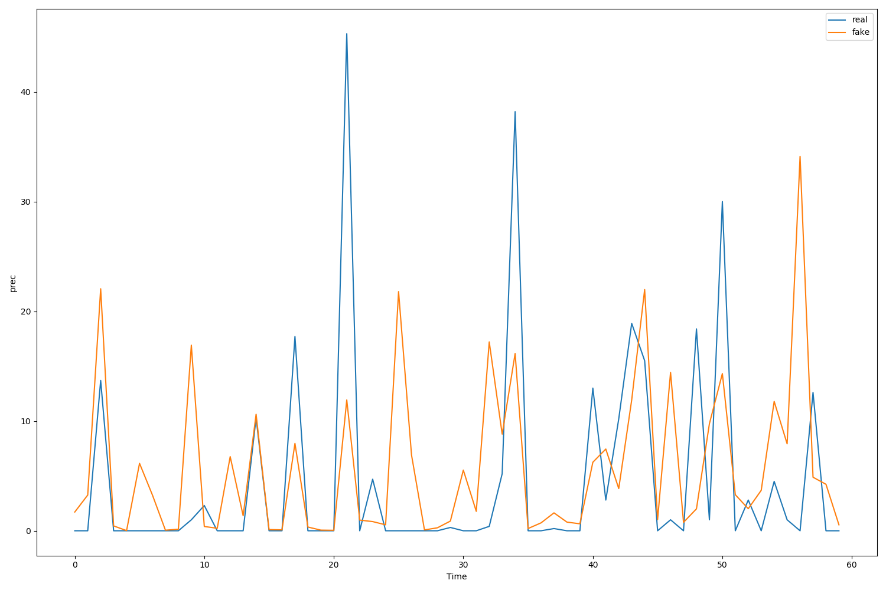
    
4月

    

    

    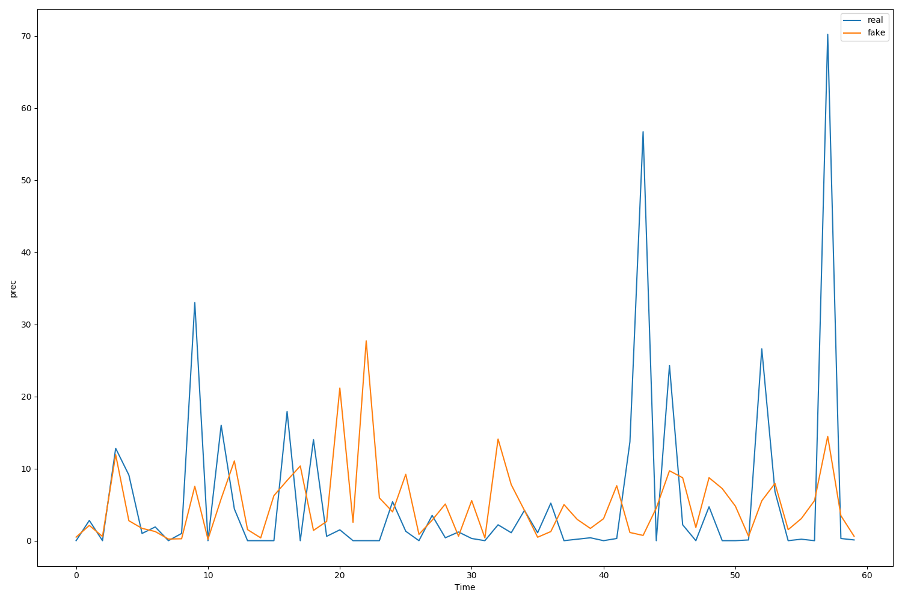
    
5月

    

    

    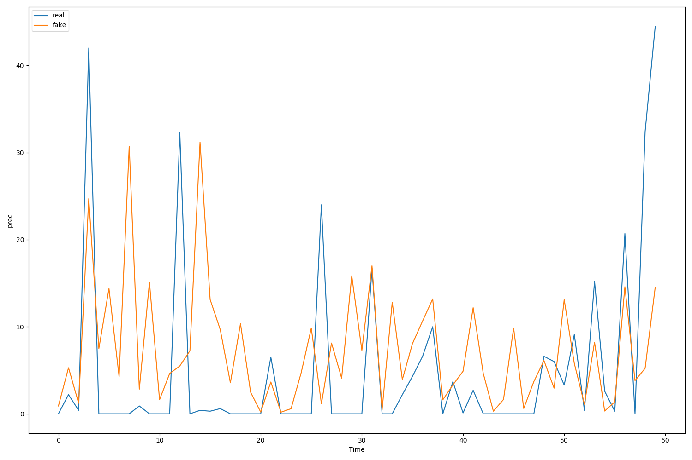
    
6月

    

    

    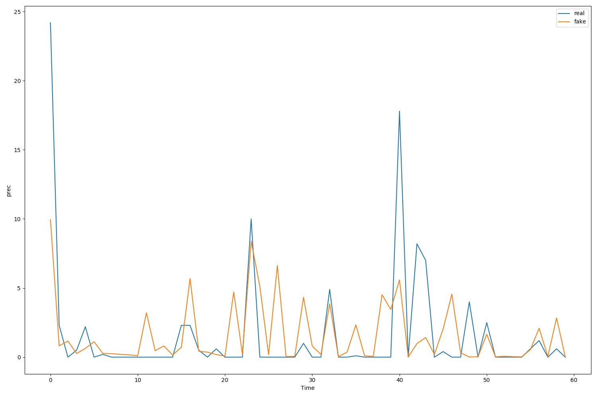
    
7月

    

    

    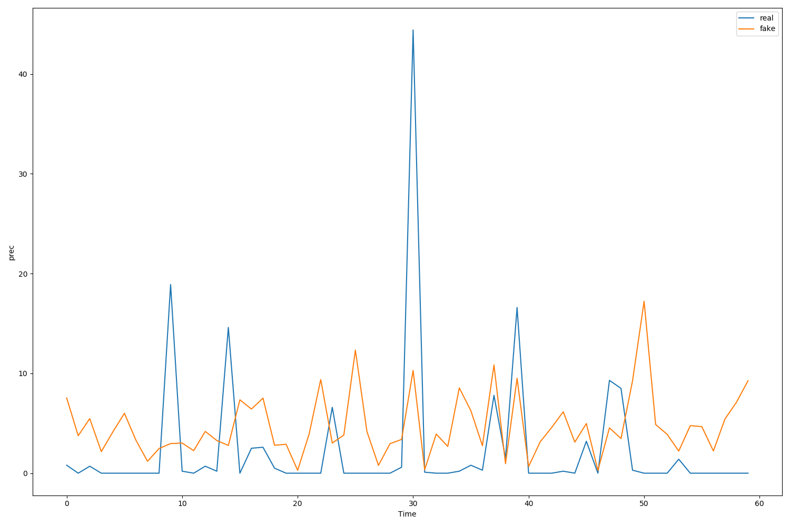
    
8月

    

    

    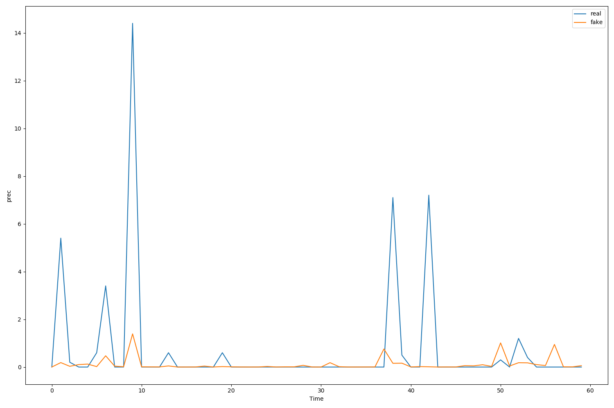
    
9月

    

    

    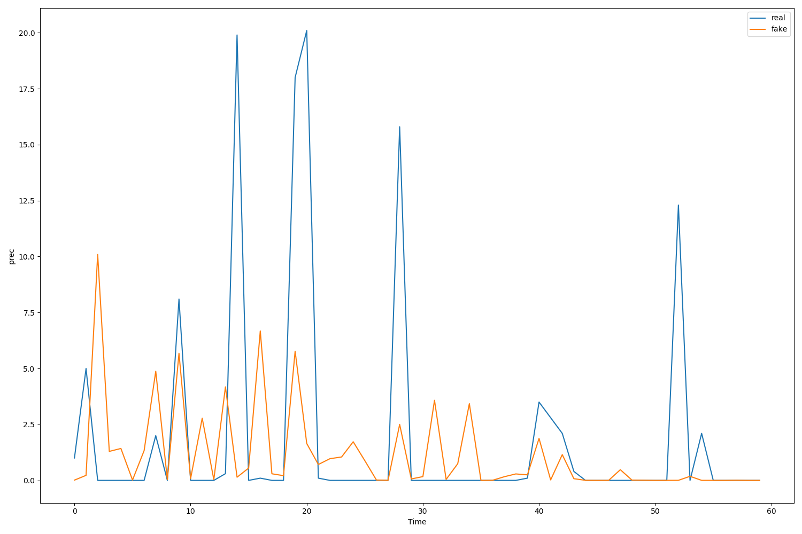
    
10月

    

    

    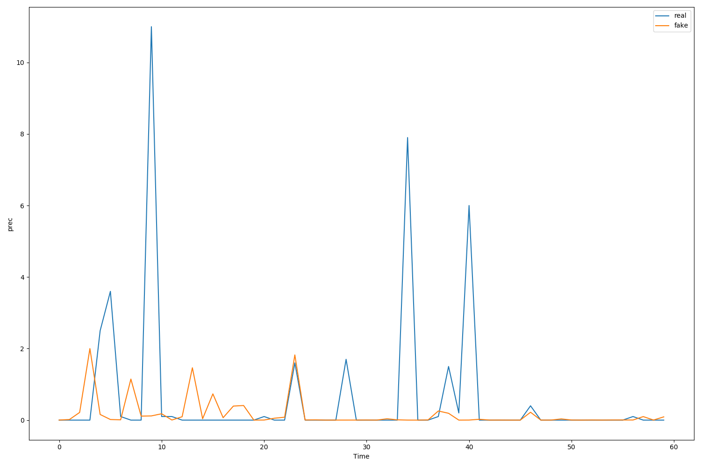
    
11月

    

## 总结

1. 就目前的预测效果来看，预测值普遍比真实值要小，这主要是数据不平衡引起的，大的降水量明显较少
2. 模型确实具备一定的降水趋势的预测能力，即它确实能够预测什么时候可能会降水，但降水量的预测差强人意
3. 经作为解码器的图卷积神经网络还原后的降水是区域性的，对细节的还原还有待加强

## 可改进之处

1. 结合模式预测的结果或许可得到更大提升
2. 或可引入seq2seq架构（个人认为应该没有任何提升效果）
3. 加入如风场等对降水量有影响的因素